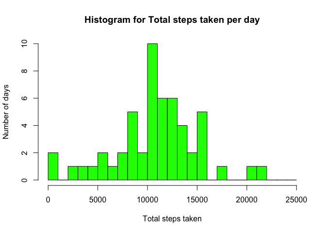
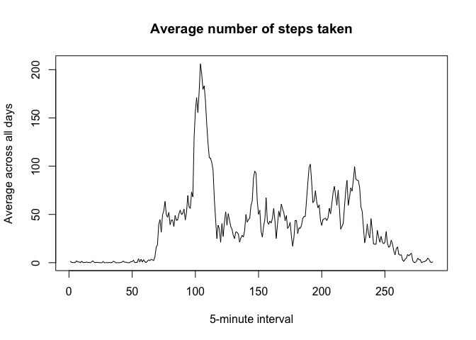
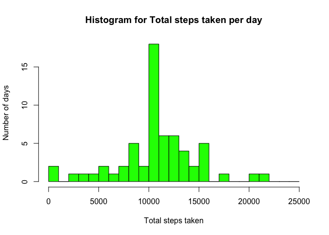
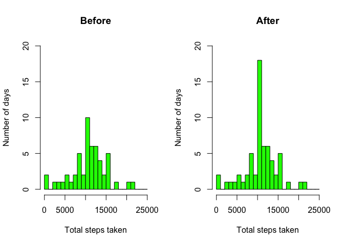

# Reproducible Research: Peer Assessment 1


## Loading and preprocessing the data


```r
# Unzip the zip archive
unzip("activity.zip")

# Load data
activity <- read.csv("activity.csv", header = TRUE)

# Clean up
unlink("activity.csv")
```

## What is mean total number of steps taken per day?

For this part of the assignment, you can ignore the missing values in
the dataset.


```r
# Ignore NA rows
activity_complete <- activity[complete.cases(activity),]
```

1. Calculate the total number of steps taken per day


```r
# Summarize and beautify table
library(plyr)
table_sum <- ddply(activity_complete,.(date), summarize, "Total Steps"=sum(steps))
names(table_sum)[1] <- "Date"

# Print the table
library(xtable)
xt <- xtable(table_sum, 
      caption="Table: Daily total steps")

print(xt,
      type="html",
      include.rownames = getOption("xtable.include.rownames", FALSE),
      html.table.attributes = getOption("xtable.html.table.attributes",
                                        "border=3, align=center"))
```

<!-- html table generated in R 3.1.3 by xtable 1.8-0 package -->
<!-- Mon Apr  4 05:28:51 2016 -->
<table border=3, align=center>
<caption align="bottom"> Table: Daily total steps </caption>
<tr> <th> Date </th> <th> Total Steps </th>  </tr>
  <tr> <td> 2012-10-02 </td> <td align="right"> 126 </td> </tr>
  <tr> <td> 2012-10-03 </td> <td align="right"> 11352 </td> </tr>
  <tr> <td> 2012-10-04 </td> <td align="right"> 12116 </td> </tr>
  <tr> <td> 2012-10-05 </td> <td align="right"> 13294 </td> </tr>
  <tr> <td> 2012-10-06 </td> <td align="right"> 15420 </td> </tr>
  <tr> <td> 2012-10-07 </td> <td align="right"> 11015 </td> </tr>
  <tr> <td> 2012-10-09 </td> <td align="right"> 12811 </td> </tr>
  <tr> <td> 2012-10-10 </td> <td align="right"> 9900 </td> </tr>
  <tr> <td> 2012-10-11 </td> <td align="right"> 10304 </td> </tr>
  <tr> <td> 2012-10-12 </td> <td align="right"> 17382 </td> </tr>
  <tr> <td> 2012-10-13 </td> <td align="right"> 12426 </td> </tr>
  <tr> <td> 2012-10-14 </td> <td align="right"> 15098 </td> </tr>
  <tr> <td> 2012-10-15 </td> <td align="right"> 10139 </td> </tr>
  <tr> <td> 2012-10-16 </td> <td align="right"> 15084 </td> </tr>
  <tr> <td> 2012-10-17 </td> <td align="right"> 13452 </td> </tr>
  <tr> <td> 2012-10-18 </td> <td align="right"> 10056 </td> </tr>
  <tr> <td> 2012-10-19 </td> <td align="right"> 11829 </td> </tr>
  <tr> <td> 2012-10-20 </td> <td align="right"> 10395 </td> </tr>
  <tr> <td> 2012-10-21 </td> <td align="right"> 8821 </td> </tr>
  <tr> <td> 2012-10-22 </td> <td align="right"> 13460 </td> </tr>
  <tr> <td> 2012-10-23 </td> <td align="right"> 8918 </td> </tr>
  <tr> <td> 2012-10-24 </td> <td align="right"> 8355 </td> </tr>
  <tr> <td> 2012-10-25 </td> <td align="right"> 2492 </td> </tr>
  <tr> <td> 2012-10-26 </td> <td align="right"> 6778 </td> </tr>
  <tr> <td> 2012-10-27 </td> <td align="right"> 10119 </td> </tr>
  <tr> <td> 2012-10-28 </td> <td align="right"> 11458 </td> </tr>
  <tr> <td> 2012-10-29 </td> <td align="right"> 5018 </td> </tr>
  <tr> <td> 2012-10-30 </td> <td align="right"> 9819 </td> </tr>
  <tr> <td> 2012-10-31 </td> <td align="right"> 15414 </td> </tr>
  <tr> <td> 2012-11-02 </td> <td align="right"> 10600 </td> </tr>
  <tr> <td> 2012-11-03 </td> <td align="right"> 10571 </td> </tr>
  <tr> <td> 2012-11-05 </td> <td align="right"> 10439 </td> </tr>
  <tr> <td> 2012-11-06 </td> <td align="right"> 8334 </td> </tr>
  <tr> <td> 2012-11-07 </td> <td align="right"> 12883 </td> </tr>
  <tr> <td> 2012-11-08 </td> <td align="right"> 3219 </td> </tr>
  <tr> <td> 2012-11-11 </td> <td align="right"> 12608 </td> </tr>
  <tr> <td> 2012-11-12 </td> <td align="right"> 10765 </td> </tr>
  <tr> <td> 2012-11-13 </td> <td align="right"> 7336 </td> </tr>
  <tr> <td> 2012-11-15 </td> <td align="right">  41 </td> </tr>
  <tr> <td> 2012-11-16 </td> <td align="right"> 5441 </td> </tr>
  <tr> <td> 2012-11-17 </td> <td align="right"> 14339 </td> </tr>
  <tr> <td> 2012-11-18 </td> <td align="right"> 15110 </td> </tr>
  <tr> <td> 2012-11-19 </td> <td align="right"> 8841 </td> </tr>
  <tr> <td> 2012-11-20 </td> <td align="right"> 4472 </td> </tr>
  <tr> <td> 2012-11-21 </td> <td align="right"> 12787 </td> </tr>
  <tr> <td> 2012-11-22 </td> <td align="right"> 20427 </td> </tr>
  <tr> <td> 2012-11-23 </td> <td align="right"> 21194 </td> </tr>
  <tr> <td> 2012-11-24 </td> <td align="right"> 14478 </td> </tr>
  <tr> <td> 2012-11-25 </td> <td align="right"> 11834 </td> </tr>
  <tr> <td> 2012-11-26 </td> <td align="right"> 11162 </td> </tr>
  <tr> <td> 2012-11-27 </td> <td align="right"> 13646 </td> </tr>
  <tr> <td> 2012-11-28 </td> <td align="right"> 10183 </td> </tr>
  <tr> <td> 2012-11-29 </td> <td align="right"> 7047 </td> </tr>
   </table>

2. Make a histogram of the total number of steps taken each day


```r
hist(table_sum[,2], xlab="Total steps taken", ylab="Number of days", main="Histogram for Total steps taken per day", col="green", breaks = seq(0,25000, 1000))
```

 

3. Calculate and report the mean and median total number of steps taken per day


```r
calculated_mean <- mean(table_sum$"Total Steps")
formatted_mean <- prettyNum(calculated_mean,big.mark = ",", decimal.mark = ".")
print(paste("Mean: ", formatted_mean))
```

```
## [1] "Mean:  10,766.19"
```

```r
calculated_median <- median(table_sum$"Total Steps")
formatted_median <- prettyNum(calculated_median,big.mark = ",", decimal.mark = ".")
print(paste("Median: ", formatted_median))
```

```
## [1] "Median:  10,765"
```

The **mean** total number of steps taken per day is **10,766.19**.

The **median** total number of steps taken per day is **10,765**.


## What is the average daily activity pattern?

1. Make a time series plot (i.e. `type = "l"`) of the 5-minute interval (x-axis) and the average number of steps taken, averaged across all days (y-axis)


```r
mean_time_series <- tapply(activity_complete$steps, activity_complete$interval, mean)

plot(type="l",
     mean_time_series,
     main="Average number of steps taken",
     xlab="5-minute interval",
     ylab="Average across all days")
```

 


2. Which 5-minute interval, on average across all the days in the dataset, contains the maximum number of steps?


```r
interval_max_steps <- which.max(mean_time_series)
interval <- names(interval_max_steps)
max_mean <- mean_time_series[interval]
formatted_max <- prettyNum(max_mean,big.mark = ",", decimal.mark = ".")
print(interval)
```

```
## [1] "835"
```

```r
print(max_mean)
```

```
##      835 
## 206.1698
```

The answer is the interval at **835** minutes with a maximum average of **206.1698** steps.


## Imputing missing values

1. Calculate and report the total number of missing values in the dataset (i.e. the total number of rows with `NA`s)

    
    ```r
    num_NA <- sum(is.na(activity))
    ```
    
    There are **2304 rows** with missing values.

2. Devise a strategy for filling in all of the missing values in the dataset. The strategy does not need to be sophisticated. For example, you could use the mean/median for that day, or the mean for that 5-minute interval, etc.

    See [Dplyr cheat sheet](https://www.rstudio.com/wp-content/uploads/2015/02/data-wrangling-cheatsheet.pdf) for details
    
    
    ```r
    # Show the starting point
    head(activity)
    ```
    
    ```
    ##   steps       date interval
    ## 1    NA 2012-10-01        0
    ## 2    NA 2012-10-01        5
    ## 3    NA 2012-10-01       10
    ## 4    NA 2012-10-01       15
    ## 5    NA 2012-10-01       20
    ## 6    NA 2012-10-01       25
    ```
    
    ```r
    # We have decided to replace the missing value by the mean for that interval
    
    # Prepare a replacement function using the mean formula
    impute.mean <- function(x) replace(x, is.na(x), mean(x, na.rm = TRUE))
    ```

3. Create a new dataset that is equal to the original dataset but with the missing data filled in.

    
    ```r
    # Split the table by interval, run the replacement function, then unsplit
    filled_activity <- ddply(activity, ~ interval, transform, steps = impute.mean(steps))
    
    # Restore the initial order
    filled_activity <- arrange(filled_activity, date)
    
    # Show results
    head(filled_activity)
    ```
    
    ```
    ##       steps       date interval
    ## 1 1.7169811 2012-10-01        0
    ## 2 0.3396226 2012-10-01        5
    ## 3 0.1320755 2012-10-01       10
    ## 4 0.1509434 2012-10-01       15
    ## 5 0.0754717 2012-10-01       20
    ## 6 2.0943396 2012-10-01       25
    ```
    
    ```r
    # Verify there is no more NA
    sum(is.na(filled_activity))
    ```
    
    ```
    ## [1] 0
    ```

4. Make a histogram of the total number of steps taken each day and Calculate and report the **mean** and **median** total number of steps taken per day. Do these values differ from the estimates from the first part of the assignment? What is the impact of imputing missing data on the estimates of the total daily number of steps?
    
    
    ```r
    # Recompute the sum by day
    ftable_sum <- ddply(filled_activity,.(date), summarize, "Total Steps"=sum(steps))
    names(ftable_sum)[1] <- "Date"
    
    hist(ftable_sum[,2], xlab="Total steps taken", ylab="Number of days", main="Histogram for Total steps taken per day", col="green", breaks = seq(0,25000, 1000))
    ```
    
     
    
    ```r
    # The previous values for mean and median were:
    print(paste("Mean: ", formatted_mean))
    ```
    
    ```
    ## [1] "Mean:  10,766.19"
    ```
    
    ```r
    print(paste("Median: ", formatted_median))
    ```
    
    ```
    ## [1] "Median:  10,765"
    ```
    
    ```r
    # The new values are
    fcalculated_mean <- mean(ftable_sum$"Total Steps")
    fformatted_mean <- prettyNum(fcalculated_mean,big.mark = ",", decimal.mark = ".")
    print(paste("Mean: ", fformatted_mean))
    ```
    
    ```
    ## [1] "Mean:  10,766.19"
    ```
    
    ```r
    fcalculated_median <- median(ftable_sum$"Total Steps")
    fformatted_median <- prettyNum(fcalculated_median,big.mark = ",", decimal.mark = ".")
    print(paste("Median: ", fformatted_median))
    ```
    
    ```
    ## [1] "Median:  10,766.19"
    ```
    
    To answer the questions in order:
    
    * Do these values differ from the estimates from the first part of the assignment?
    
    The mean and median values don't differ much from the first part.
    
    * What is the impact of imputing missing data on the estimates of the total daily number of steps?
    
    While the mean hasn't changed, the histogram shows a significant increase of the total daily number of steps taken at the 10,000 steps bucket.
    
    A side-by-side comparison will be useful:
    
    
    ```r
    par(mfrow=c(1,2))
    hist(table_sum[,2], xlab="Total steps taken", ylab="Number of days", main="Before", col="green", breaks = seq(0,25000, 1000), ylim=c(0,20))
    hist(ftable_sum[,2], xlab="Total steps taken", ylab="Number of days", main="After", col="green", breaks = seq(0,25000, 1000), ylim=c(0,20))
    ```
    
     
    
    ```r
    par(mfrow=c(1,1))
    ```


## Are there differences in activity patterns between weekdays and weekends?

For this part the `weekdays()` function may be of some help here. Use
the dataset with the filled-in missing values for this part.

1. Create a new factor variable in the dataset with two levels -- "weekday" and "weekend" indicating whether a given date is a weekday or weekend day.

    
    ```r
    # First compute the week day
    filled_activity$weekday <- as.factor(weekdays(as.Date(filled_activity$date)))
    
    # Then compute the day type
    filled_activity$daytype <- filled_activity$weekday
    levels(filled_activity$daytype) <- list(weekday = c("Monday", "Tuesday", "Wednesday", "Thursday", "Friday"), weekend = c("Saturday", "Sunday"))
    
    str(filled_activity)
    ```
    
    ```
    ## 'data.frame':	17568 obs. of  5 variables:
    ##  $ steps   : num  1.717 0.3396 0.1321 0.1509 0.0755 ...
    ##  $ date    : Factor w/ 61 levels "2012-10-01","2012-10-02",..: 1 1 1 1 1 1 1 1 1 1 ...
    ##  $ interval: int  0 5 10 15 20 25 30 35 40 45 ...
    ##  $ weekday : Factor w/ 7 levels "Friday","Monday",..: 2 2 2 2 2 2 2 2 2 2 ...
    ##  $ daytype : Factor w/ 2 levels "weekday","weekend": 1 1 1 1 1 1 1 1 1 1 ...
    ```

1. Make a panel plot containing a time series plot (i.e. `type = "l"`) of the 5-minute interval (x-axis) and the average number of steps taken, averaged across all weekday days or weekend days (y-axis). 

    
    ```r
    final_table <- ddply(filled_activity,.(daytype, interval), summarize, "average"=mean(steps))
    
    library(lattice)
    xyplot(average ~ interval | daytype, final_table, type="l", lwd=1, layout = c(1,2), xlab="Interval",ylab="Number of steps")
    ```
    
     


